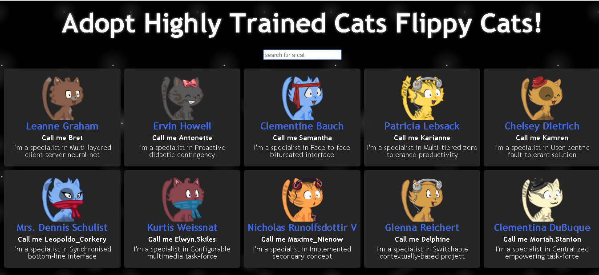

# React cats app with fetch api

## Quick Start

``` bash
# Install dependencies for server
npm install

# To start use
npm start

# Client runs on http://localhost:3000
```

## Folder Distribution

The workflow I currently use is as follows:

- public
    - index.html 
- src
    - Assets
        - css
        - scss
    - components
        - Cat
            - cat.js
        - CatList
            - catList.js
        - SearchBox
            - searchBox.js
    - App.js
    - index.js
    - regex.js
- gulpfile.js

This is an App made to showcase how to use the Fetch Api to get a Json from a website and show it in the UI. 



As shown in the directory, we have a cat component which are shown in a grid in catList. For cat.js we used this API https://robohash.org/${id}?set=set4 where the ${id} is a random number to get different cats from the site, we used Styled Components to style each component like we would do in normal CSS, as of now its the prefered way of styling I'm gonna use since I'm not a fan of using CSS Frameworks due to the limitations they can impose.

## Logic of the App

### Fetch Api and showing it in the UI.

We use componentDidMount to fetch random names, usernames, phrases, age, etc, and we took some basic data from it:

``` bash
fetch("https://jsonplaceholder.typicode.com/users")
      .then(response => response.json())
      .then(data => this.setState({ cats: data }));
```

We fetch an object and we get a response (a JSON file) which we turn into a javascript object and we assign the data (object) into the state. Then we send the state into the "CatList" component through a property named "cats" and we check every item in the array of objects and assign the respective properties to the "Cat" component which takes the data recieved from "CatList" and show it in UI like this:

``` bash
const Cat = ({ name, username, phrase, id }) => {
  return (
    <Cell>
      <CardBody>
        <CardImage src={`https://robohash.org/${id}?set=set4`} alt="cats" />
        <CardName primary>{name}</CardName>
        <CardName>Call me {username}</CardName>
        <CardPhrase>I'm a specialist in {phrase}</CardPhrase>
      </CardBody>
    </Cell>
  );
};
```

We send name, username, phrase and id from the initial data we fetched into the CatList component and map it taking each object in the array and sent each property to the Cat component. This is the general way of using Fetch and showing it in the UI.

### Searchbox

We add another interesting component to the App, and its a Searchbox, basically we write the **name** of the Cat we want and isolate him/her from the rest. We created a simple input which has a property called "OnChange" where when we type on the input, we assign that value to the state and we filter the array of objects, where we send a filtered array to the CatList component and we get the specific Cat **name** we typed. The filter takes the value and uses the .include() method to see if it belongs to the value **name**  of the object, if it does, then return a new array with the names we wrote on the input.

``` bash
const filteredCats = cats.filter(cat => {
      return cat.name.toLowerCase().includes(searchField.toLowerCase());
    });
```

### Styled Components and Styled-CSS-Grid

For the style we used Styled Components where in the links in the next section we can install it and use inmediatly.

``` bash
const Title = styled.h1`
  text-align: center;
  padding: 20px;
  font-size: 60px;
  font-family: "Trebuchet MS", Verdana, sans-serif;
  text-shadow: 0px 0px 6px rgba(255, 255, 255, 0.7);
  color: white;
  &:hover {
    transition: 0.5s ease;
    text-decoration: underline;
  }
  @media (max-width: 768px) {
    font-size: 40px;
  }
  @media (max-width: 500px) {
    font-size: 30px;
  }
`;
```

Where we take a tag we want to style, in this case the h1 and use the shown syntax to write normal CSS providing a way to truly encapsulate a component and make it reusable if we want like this:

``` bash
const CardName = styled.h1`
  color: ${props => (props.primary ? "royalblue" : "white")};
  padding: 3px;
  font-size: ${props => (props.primary ? "22px" : "16px")};
`;
```

Where we use template strings, if the CardName component has a primary property then we assign it the color "royalblue" otherwise use white, there are a lot of ways to customize your own components and this makes compliments the idea of React JS in a perfect way.

Styled-CSS-Grid on the other hand makes it very simple to create your own layouts as well as shown in the documents. In this case we used:

``` bash
<Grid
    columns={"repeat( auto-fit, minmax(250px, 1fr) )"}
    justifyContent={"center"}
    alignContent={"center"}
>
    <Cell>
    <Cell>
    ...
</Grid>
``` 

And just like that, we created a responsive grid which centers everything inside it! These two tools combined can make anyone forget about using CSS Frameworks if you wish to use your own style, but the best part is the control you will have over your own code.

## Closure

This is an App to show how to use the Fetch Api to get a JSON file from an external source and use it to manipulate the data from it and show it on UI. We also show how we could use this information to create a Searchbox filtering the data and in contrast, changing the UI in response to editing the JSON file we got. This was a perfect chance to try the [Styled Components](https://www.styled-components.com/) which provided a confortable and easy way to write Vanilla CSS, since Frameworks tend to limit us and we end up fighting it to make it adapt to what we or the client wants.

Another interesting thing we used was [Styled-Css-Grid](https://styled-css-grid.js.org/), which provides CSS Grids in terms of components, which was something I was going to create myself but out of curiosity searched and saw it was alredy made. This makes an easy way to create Layouts for our website with the flexibility CSS Grids provides.

**Made by Adrian Beria.**

**React js Front-End Web Developer.**